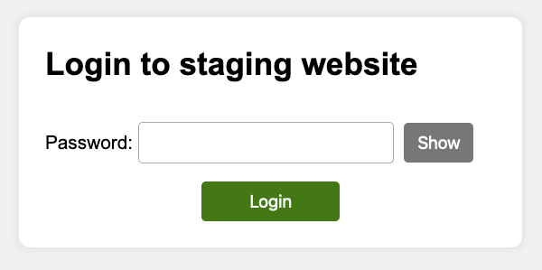

# Staging site password

A simple tool to password restrict a staging environment. 

## What does it do?

When creating or updating a website it's good practise to publish changes to a staging environment to review before going live.

This package helps secure staging websites behind a simple, accessible login page. This is easier to use than basic authentication and 
remembers your login in a cookie, so you don't have to keep entering your password.
 
[](screenshot.png)

## Requirements

* PHP 7.4+
* [Composer](https://getcomposer.org/)

## Installation

Install via Composer:

```bash
composer require studio24/staging-site-passsword:^1.0
```

## Usage

### Create a password hash

Your staging site password needs to be stored as secure hash. You can generate this via [password_hash](https://www.php.net/password-hash) 
or by using the provided command line script.  

```bash
php vendor/bin/password-hash.php
```

### Store the password hash

TODO


Store the password hash in an environment variable or PHP constant. The example below is for the password "test123"

Environment variable:

```php
putenv('STAGING_SITE_PASSWORD=$2y$10$pvDrmW9GW0bLVDMtLwLnn.mFof5eQQwlozZ5kYK7xijQRVAWUw0FK');
```

PHP constant:

```php
define('STAGING_SITE_PASSWORD', '$2y$10$pvDrmW9GW0bLVDMtLwLnn.mFof5eQQwlozZ5kYK7xijQRVAWUw0FK');
```

Or in PHP:

```php
$controller->auth->setPasswordHash($hash); 
```

### Integrate with your website

#### WordPress

TODO

#### Laravel

#### PHP websites

Enable the staging site login page via:

```php
$controller = new \Studio24\StagingSitePassword\Controller();
if ($controller->isStaging()) {
    $controller->authenticate();
}
```

## How to customise the login page

If you want to customise any options, you can do so via the controller object. Make sure you add your code before `$controller->authenticate()` 
is run. For example:

```php
$controller = new \Studio24\StagingSitePassword\Controller();
$controller->loginPage->setPlaceholder('title', 'Login to My Website');
if ($controller->isStaging()) {
    $controller->authenticate();
}
```

### Text

You can customise any text on the login page via `$controller->loginPage->setPlaceholder($name, $value)`.

Customise the title:

```php
$controller->loginPage->setPlaceholder('title', 'Login to My Website');
```

Customise the footer text (you can include HTML):

```php
$controller->loginPage->setPlaceholder('footer', 'Get support from <a href="mailto:support@studio24.net">Studio 24</a>');
```

The full list of placeholders:

| Placeholder  | Default content |
|--------------|-----------------|
| `title` | Login to staging website   |
| `footer` |     |
| `password_field_label` | Password    |
| `submit_field_label` | Login    |
| `title_prefix_on_error` | Error:     |
| `error_message_title` | There is a problem    |
| `error_message` | The password is incorrect    |
| `show` | Show    |
| `hide` | Hide    |
| `show_password` | Show password    |
| `hide_password` | Hide password    |

### Cookie lifetime

By default, the login cookie is set to expire after 1 day. You can customise this via:

```php
$controller->auth->setCookieLifetime(3600); 
```

This sets the cookie lifetime in seconds.

You can also set this in days:

```php
$controller->auth->setCookieLifetimeInDays(7); 
```

You can also change the cookie name (default is `staging_site_remember_login`):

```php
$controller->auth->setCookieName('remember_me'); 
``` 